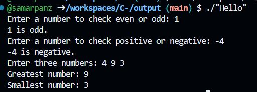
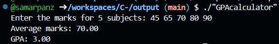

# C-
It might contain C programs taught in scl and clz 

## Useful git commands

## Hello.c Program Output

The image below shows the output for the `Hello.c` program.

## GPAcalculator.c Program Output

The image below shows the output for the `Hello.c` program.

